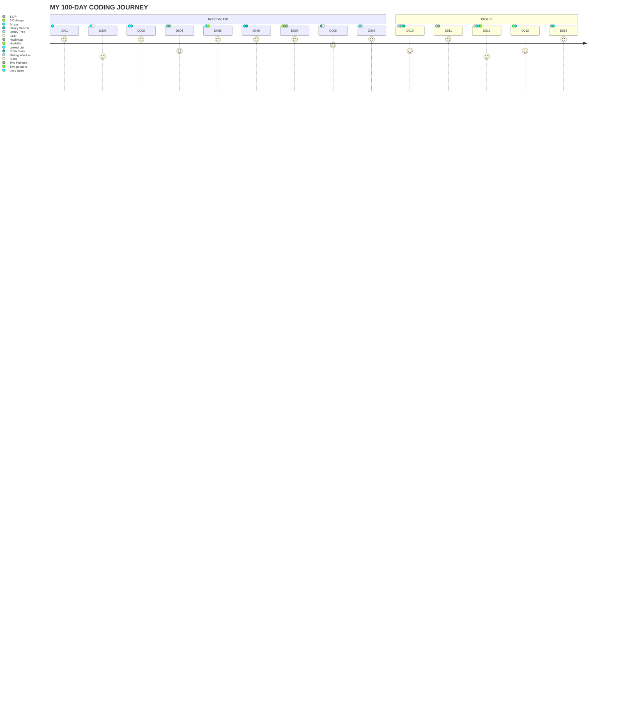

# 100 Days Of Code - Log


> [!IMPORTANT]
> - All solutions from this log are my own.
> - I am keeping track of my progress as I go through the challenge.
> - I hope to see constant improvements on performance, algorithms, and data structures choices.
> - Mostly keeping track of the LC questions but I solve on multiple platforms, unfortunately these are not as standardized

## Day 1
Public accountability and date on [X](https://x.com/Edddushi/status/1799998093464838351)
> [!NOTE]
> Written in Python
### Accomplishments
- Solved the Merge Strings Altenately on LeetCode #1768
- Learned how to traverse an array with multiple indices
### Challenges
- Struggled understanding all moving parts at first, I started actually thinking out loud at the end

<details>
  <summary>CLICK TO VIEW SOLUTION</summary>

   ```python
    def mergeAlternately(self, word1: str, word2: str) -> str:
        len1 = len(word1)
        len2 = len(word2)
        size = min(len1, len2) * 2
        result = ""
        counter = 0
        i = 0
        j = 0

        while size > 0:
            if counter % 2 == 0:
                result += word1[i]
                i += 1
            else:
                result += word2[j]
                j += 1
            size -= 1
            counter += 1

        if len1 > len2:
            result += word1[i:]
        elif len1 < len2:
            result += word2[j:]

        return result
   ```
  
</details>


## Day 2
Public accountability and date on [X](https://x.com/Edddushi/status/1800370219149656207)
> [!NOTE]
> Written in Python
### Accomplishments
- Solved the Greatest Common Divisor of Strings on LeetCode #1071
- In hindisght I should have been able to tell by the name I would need my Maths hat for this one, but I learnt it the hard way
### Challenges
- This felt like an easy hard question. Not because the solution is particularly hard to implement, realizing the maths behind it is the tricky part
  
<details>
  <summary>CLICK TO VIEW SOLUTION</summary>

   ```python
    class Solution:
        def gcdOfStrings(self, str1: str, str2: str) -> str:
            size1 = len(str1)
            size2 = len(str2)
            longer_word = str1 if (size1 > size2) else str2
            shorter_word = str2 if (size1 > size2) else str1
            common_str = shorter_word
            i = 1
    
            if( size1 == 0 or size2 == 0):
                return ""
    
            for j in range(min(size1, size2)):
                gcd = len(common_str)

                #only if the substring is divisible then can it be a multiple of any of the strings
                if(size1 % gcd == 0 and size2 % gcd == 0):
    
                    multiplier1 = int(size1 / len(common_str))
                    multiplier2 = int(size2 / len(common_str))

                    #the substring must be a multiple of both strings not just the longest or shortest
                    if(str1 == common_str * multiplier1 and str2 == common_str * multiplier2):
                        return common_str

                #checking each substring starting from the full shortest word, one character less each time
                common_str = shorter_word[:-i]
                i += 1 
    
            return ""
   ```
  
</details>

## Day 3
Public accountability and date on [X](https://x.com/Edddushi/status/1800736235088146658)
> [!NOTE]
> Written in Python
### Accomplishments
- Solved the Kids With the Greatest Number of Candies LeetCode #1431
- I immediately knew what to do, I beat 72% of submission with my very first solution
### Challenges
- I couldn't figure out at first why my list was not making a shallow copy. It turns out that if you just assign the list like sorted_candies = candies, it makes a deep copy.
  
<details>
  <summary>CLICK TO VIEW SOLUTION</summary>

   ```python
    class Solution:
        def kidsWithCandies(self, candies: List[int], extraCandies: int) -> List[bool]:
            sorted_candies = candies[:]
            sorted_candies.sort()
            boolean_arr = []
    
            for i in range(len(candies)):
                if(candies[i] + extraCandies >= sorted_candies[-1]):
                    boolean_arr.append(True)
                else:
                    boolean_arr.append(False)
            return boolean_arr
   ```
</details>

## Day 4
Public accountability and date on [X](https://x.com/Edddushi/status/1800943305779257712)
> [!NOTE]
> Written in Python
### Accomplishments
| Reverse Vowels of a String LeetCode #345  | Can Place Flowers LeetCode #605 |
| ------------- | ------------- |
| Straightforward solution on this one (or maybe I am getting more intuitive)  | Learned that it is okay to start with the most intuitive approach rather than optimizing in my head  |
| Learned how to properly use two pointers by changing the values according to circumstance  | Used an incremental process to realize my mishaps|
### Challenges     
| Reverse Vowels of a String LeetCode #345  | Can Place Flowers LeetCode #605 |
| ------------- | ------------- |
| Dealing with two pointers that behave inversely was a learning hill | Completely underestimated the cases and ended up having a hard time adjusting from what I thought was absolutely right |
| Didn't go through my initial solution and was too confident |  It unfortunately took a long time before I realized that it was a matter of checking adjacent 0's|

<details>
  <summary>CLICK TO VIEW SOLUTION TO LC#345</summary>

   ```python
    def reverseVowels(self, s: str) -> str:
        vowels = ['a', 'e', 'i', 'o', 'u', 'U', 'O', 'I', 'E', 'A']
        sAsList = list(s)
        i = 0
        j = len(s)-1

        while(j > i):
            if s[i] in vowels:
                if s[j] in vowels:
                    temp = sAsList[j]
                    sAsList[j] = sAsList[i]
                    sAsList[i] = temp
                    j -= 1
                    i += 1
                else:
                    j -= 1
            else:
                i += 1
        
        return ''.join(sAsList)
   ```
</details>


<details>
  <summary>CLICK TO VIEW SOLUTION TO LC#605</summary>

   ```python
    def canPlaceFlowers(self, flowerbed: List[int], n: int) -> bool:
        alternate = 0
        i = 0

        if(n == 0):
            return True
        
        #Making sure we have a minimum of two spots in the flowerbed for the for loop logic
        if(len(flowerbed) == 1 and n <= 1 and flowerbed[0] == 0):
            return True
        elif(len(flowerbed) == 1 and n > 1):
            return False

        while(i < len(flowerbed)):
            if(i == 0 and flowerbed[i] == 0 and flowerbed[i+1] == 0):
                alternate += 1
                i += 1
            elif( i != 0 and i != len(flowerbed)-1 and flowerbed[i-1] == 0 and flowerbed[i] == 0 and flowerbed[i+1] == 0):
                alternate += 1
                i += 1
            elif(i == len(flowerbed)-1 and flowerbed[i] == 0 and flowerbed[i-1] == 0):
                alternate += 1
                i += 1
            i+=1


        return alternate >= n
   ```
</details>

## Day 5
Public accountability and date on [X](https://x.com/Edddushi/status/1801463290381336955)
> [!NOTE]
> Written in Python
### Accomplishments
| Move Zeroes LeetCode #283  | Is Subsequence LeetCode #392 |
| ------------- | ------------- |
| Straightforward solution  | Solution was intuitive and efficient |
### Challenges     
| Move Zeroes LeetCode #283 | Is Subsequence LeetCode #392 |
| ------------- | ------------- |
| Minor indexing issues | Missed special cases when letters are repeated or we reach the end of the parent string before the subsequence is done |

<details>
  <summary>CLICK TO VIEW SOLUTION TO LC#283</summary>

   ```python
    def moveZeroes(self, nums: List[int]) -> None:
        """
        Do not return anything, modify nums in-place instead.
        """
        i = 0
        j = len(nums) - 1

        while(j > i):
            if(nums[i] == 0):
                nums.pop(i)
                nums.append(0)
                j -= 1
            if(nums[i] != 0):
                i += 1
   ```
</details>


<details>
  <summary>CLICK TO VIEW SOLUTION TO LC#392</summary>

   ```python
    def isSubsequence(self, s: str, t: str) -> bool:
        if(len(s) == 0):
            return True
        
        if(len(s) > len(t)):
            return False
        
        left  = 0
        right  = 0

        while(left < len(s)):
            # End loop if all characters were exhausted in both strings and no match
            if(right == len(t)):
                return False
                
            if(t[right] == s[left]):
                left += 1
            right += 1

        return True
   ```
</details>

## Day 6
Public accountability and date on [X](https://x.com/Edddushi/status/1801816263699640713)
> [!NOTE]
> Written in Python
### Accomplishments
- Solved the Find Pivot Index LeetCode #1431
- The solution was straightforward but needed improvement once I saw my submission runtime
### Challenges
- There was a slightly simpler solution that I did not think of
  
<details>
  <summary>CLICK TO VIEW SOLUTION</summary>

   ```python
    def pivotIndex(self, nums: List[int]) -> int:
        if len(nums) == 1:
            return 0

        total = sum(nums)
        leftSum = 0

        for i in range(len(nums)):
            rightSum = sum(nums[i + 1 :])

            if(leftSum == rightSum):
                return i

            leftSum += nums[i]

        return -1
   ```
</details>

## Day 7
Public accountability and date on [X](https://x.com/Edddushi/status/1802176966960808294)
> [!NOTE]
> Written in Python
### Accomplishments
| Valid Palindrome LeetCode #125  | Two Sum LeetCode #1 | Valid Anagram LeetCode #242 | Contains Duplicate #217
| ------------- | ------------- |------------- | ------------- |
| Learned more about AscII | Learned more about HashMaps in python | Leveraged sorting to find faster solutions | Learned more about HashSets|

<details>
  <summary>CLICK TO VIEW SOLUTIONS</summary>

   ```python
    def isPalindrome(self, s: str) -> bool:
        i = 0
        j = len(s) - 1

        while(i < j):
            while(j > i and not self.isAscii(s[j])):
                j -= 1
            while(i < j and not self.isAscii(s[i])):
                i += 1
            
            if(s[i].lower() != s[j].lower()):
                return False

            i += 1
            j -=1

        return True

    def isAscii(self, character: str) -> bool:
        return ((character >= "a" and character <= "z")) or (character >= "A" and character <= "Z") or (character >= "0" and character <= ("9"))

   ```

   ```python
    def twoSum(self, nums: List[int], target: int) -> List[int]:
        diffs = {}

        for i in range(len(nums)):
            if(target - nums[i] not in diffs):
                diffs[nums[i]] = i
            else:
                return [diffs[target - nums[i]], i]

   ```

   ```python
    def isAnagram(self, s: str, t: str) -> bool:
        if(len(s) != len(t)):
            return False

        sMap = {}
        tMap = {}

        for i in range(len(s)):
            sMap[s[i]] = 1 + sMap.get(s[i], 0)
            tMap[t[i]] = 1 + tMap.get(t[i], 0)

        for c in sMap:
            if sMap[c] != tMap.get(c, 0):
                return False

        return True

   ```

   ```python
    def containsDuplicate(self, nums: List[int]) -> bool:
        duplicates  = set()

        for n in nums:
            if(n in duplicates):
                return True

            duplicates.add( n )

        return False
   ```
</details>

## Day 8
Public accountability and date on [X](https://x.com/Edddushi/status/1802551637786960178)
> [!NOTE]
> Written in Python
### Accomplishments
| Valid Parantheses #20 | Binary Search #704 |
| ------------- | ------------- |
| Straightforward solution  | Solution was intuitive and efficient |
### Challenges     
| Valid Parantheses #20 | Binary Search #704 |
| ------------- | ------------- |
| Minor indexing issues when finding the middle | No issues, mostly understanding the problem being asked |

<details>
  <summary>CLICK TO VIEW SOLUTION TO LC#20</summary>

   ```python
    def isValid(self, s: str) -> bool:
        mapping = { ")" : "(", "}" : "{", "]" : "["}
        opening = "({["
        closing = "]})"
        stack = []

        for i in s:
            if(i in opening):
                stack.append(i)
            elif(i in closing):
                if(not stack):
                    return False
                    
                value = stack.pop()
                if value != mapping[i]:
                    return False

        if stack:
            return False

        return True
   ```
</details>


<details>
  <summary>CLICK TO VIEW SOLUTION TO LC#704</summary>

   ```python
    def search(self, nums: List[int], target: int) -> int:
        i, j = 0, len(nums) - 1

        while(i <= j):
            mid = (i + j ) // 2

            if(nums[mid] > target):
                j = mid - 1
            elif(nums[mid] < target):
                i = mid + 1
            else:
                return mid
        return -1
   ```
</details>

## Day 9
Public accountability and date on [X](https://x.com/Edddushi/status/1802908740292665573)
> [!NOTE]
> Written in Python
### Accomplishments
| Reverse Linked List #206  | Best Time to Buy and Sell Stock #121 |
| ------------- | ------------- |
| Learned how linked lists are set up in python | Learned about sliding window |
### Challenges     
| Reverse Linked List #206  | Best Time to Buy and Sell Stock #121 |
| ------------- | ------------- |
| Mixed up pointers and nodes, confusion not realising we are not actually moving the nodes ever | No issues, went very well|

<details>
  <summary>CLICK TO VIEW SOLUTION TO LC#206</summary>

   ```python
    # Definition for singly-linked list.
    # class ListNode:
    #     def __init__(self, val=0, next=None):
    #         self.val = val
    #         self.next = next
        def reverseList(self, head: Optional[ListNode]) -> Optional[ListNode]:
            prev, curr = None, head
    
            while(curr is not None):
                temp = curr.next
                curr.next = prev
                prev = curr
                curr = temp
                
            return prev
   ```
</details>

<details>
  <summary>CLICK TO VIEW SOLUTION TO LC#121</summary>

   ```python
    def maxProfit(self, prices: List[int]) -> int:
        l, r = 0, 1
        maximum = 0

        while(r < len(prices)):
            profit = prices[r] - prices[l]

            if(maximum < profit):
                maximum = profit

            if(prices[r] < prices[l]):
                l = r

            r += 1

        if(maximum < 0):
            return 0

        return maximum
   ```
</details>

## Day 10
Public accountability and date on [X](https://x.com/Edddushi/status/1803271830251139414)
> [!NOTE]
> Written in Python.
> Due to an increase in the number of problems to solve, I will reflect on the overview rather than specific problems.
### Accomplishments
| Binary Tree | Linked List |
| ------------- | ------------- |
| Improved depth first search through recursion | Learned how to manipulate pointers in python |
### Challenges     
| Binary Tree | Linked List |
| ------------- | ------------- |
| Unable to distinguish the main operation of the recursion| Challenging intuition |

<details>
  <summary>CLICK TO VIEW SOLUTIONS </summary>

   ```python
    #LC21
    def mergeTwoLists(self, list1: Optional[ListNode], list2: Optional[ListNode]) -> Optional[ListNode]:
        dummy = ListNode()
        head = dummy

        while(list1 and list2):
            if(list1.val <= list2.val):
                head.next = list1
                list1 = list1.next
            else:
                head.next = list2
                list2 = list2.next

            head = head.next

        if(list1 is None):
            head.next = list2
        elif(list2 is None):
            head.next = list1

        return dummy.next
   ```

   ```python
#LC141
# Definition for singly-linked list.
# class ListNode:
#     def __init__(self, val=0, next=None):
#         self.val = val
#         self.next = next

class Solution:
    def hasCycle(self, head: Optional[ListNode]) -> bool:
        slow, fast = head, head

        while fast and fast.next:
            slow = slow.next
            fast = fast.next.next

            if(slow == fast):
                return True
                
        return False
   ```

   ```python
#LC226
# Definition for a binary tree node.
# class TreeNode:
#     def __init__(self, val=0, left=None, right=None):
#         self.val = val
#         self.left = left
#         self.right = right

class Solution:
    def invertTree(self, root: Optional[TreeNode]) -> Optional[TreeNode]:
        return self.invert(root)

    def invert(self, root):
        if(root is None):
            return root
        
        self.invert(root.left)
        self.invert(root.right)

        temp = root.left
        root.left = root.right
        root.right = temp

        return root
   ```

   ```python
#LC100
# Definition for a binary tree node.
# class TreeNode:
#     def __init__(self, val=0, left=None, right=None):
#         self.val = val
#         self.left = left
#         self.right = right

class Solution:
    def isSameTree(self, p: Optional[TreeNode], q: Optional[TreeNode]) -> bool:
        if(not p and not q):
            return True
        if(not p or not q):
            return False
        if(p.val != q.val):
            return False
        
        return self.isSameTree(p.left, q.left) and self.isSameTree(p.right, q.right)
   ```

   ```python
#LC1832
class Solution:
  def isAlpha(self, character: str):
    return character.upper() >= "A" and character.upper() <= "Z" 

  def checkIfPangram(self, sentence):
    mapping = {
    "A": 0,
    "B": 0,
    "C": 0,
    "D": 0,
    "E": 0,
    "F": 0,
    "G": 0,
    "H": 0,
    "I": 0,
    "J": 0,
    "K": 0,
    "L": 0,
    "M": 0,
    "N": 0,
    "O": 0,
    "P": 0, 
    "Q": 0,
    "R": 0,
    "S": 0,
    "T": 0,
    "U": 0,
    "V": 0,
    "W": 0,
    "X": 0,
    "Y": 0, 
    "Z": 0
    }

    for i in sentence:
      if self.isAlpha(i):
        mapping[i.upper()] = 1 + mapping.get(i.upper(), 0)
      
    if 0 in mapping.values():
      return False

    return True
   ```
</details>


## Day 11
Public accountability and date on [X](https://x.com/Edddushi/status/1803631661021565315)
> [!NOTE]
> Written in Python.
> Due to an increase in the number of problems to solve, I will reflect on the overview rather than specific problems.
### Accomplishments
| Binary Tree | Two Pointers |
| ------------- | ------------- |
| Improved binary tree manipulation through recursion | Improved two pointer usage in python |
### Challenges     
| Binary Tree | Two Pointers |
| ------------- | ------------- |
| Had issues breaking down the problem and apply it to recursion| None this time |

<details>
  <summary>CLICK TO VIEW SOLUTIONS </summary>

   ```python
    #LC104
    def maxDepth(self, root: Optional[TreeNode]) -> int:
        if(not root):
            return 0
        
        stack = [[root, 1]]
        maximum = 0

        while(stack):
            node, level = stack.pop()

            if(node):
                maximum = max(level, maximum)
                stack.append([node.left, level + 1])
                stack.append([node.right, level + 1])

        return maximum
   ```

   ```python
    #LC572
    def isSubtree(self, root: Optional[TreeNode], subRoot: Optional[TreeNode]) -> bool:
        if(root and not subRoot):
            return True
        if(not root and subRoot):
            return False
        
        if(self.isSimilar(root, subRoot)):
            return True
        
        return self.isSubtree(root.left, subRoot) or self.isSubtree(root.right, subRoot)

    def isSimilar(self, root, subRoot):
        if(not root and not subRoot):
            return True
        
        if root and subRoot and (root.val == subRoot.val):
            return self.isSimilar(root.left, subRoot.left) and self.isSimilar(root.right, subRoot.right)

        return False

   ```
</details>

## Day 12
Public accountability and date on [X](https://x.com/Edddushi/status/1803986183317320190)
> [!NOTE]
> Written in Python.
> Due to an increase in the number of problems to solve, I will reflect on the overview rather than specific problems.
### Accomplishments
| Binary Tree | Two Pointers | LinkedList | 2-D arrays
| ------------- | ------------- | ------------- | ------------- |
| More complex binary tree recursions | Improved two pointer usage in python | More complex techniques with linked lists | Identified knowledge gap with 2-D arrays
### Challenges     
| Binary Tree | Two Pointers | LinkedList | 2-D arrays
| ------------- | ------------- | ------------- | ------------- |
| I find myself needing help on solutions | None this time | Still confused with pointers| Complete lack of knowledge, including geometry and such |

<details>
  <summary>CLICK TO VIEW SOLUTIONS </summary>

   ```python
    #LC36
   def isValidSudoku(self, board: List[List[str]]) -> bool:
        size = len(board)
        rows = collections.defaultdict(set)
        cols = collections.defaultdict(set)
        grid = collections.defaultdict(set)

        for i in range(size):
            for j in range(size):
                value = board[i][j]

                if( value != "."):
                    if(value in rows[i]):
                        return False
                    elif(value in cols[j]):
                        return False
                    elif(value in grid[(i//3, j//3)]):
                        return False
                    
                    rows[i].add(value)
                    cols[j].add(value)
                    grid[i//3, j//3].add(value)

        return True
   ```

   ```python
    #LC48
    def rotate(self, matrix: List[List[int]]) -> None:
        n = len(matrix)

        for i in range(n):
            for j in range(i+1, n):
               matrix[j][i], matrix[i][j] = matrix[i][j], matrix[j][i]

        for i in range(n):
            for j in range(n // 2):
                matrix[i][j], matrix[i][n - 1 - j] = matrix[i][n - 1 - j], matrix[i][j]

   ```
</details>

## Day 13
Public accountability and date on [X](https://x.com/Edddushi/status/1804354226316775652)
> [!NOTE]
> Written in Python.
> Due to an increase in the number of problems to solve, I will reflect on the overview rather than specific problems.
### Accomplishments
| 2-D Arrays | Arrays|
| ------------- | ------------- |
| Improved matrix manipulation through recursion | String manipulation with the number of ways approach|
### Challenges     
| 2-D Arrays | Arrays|
| ------------- | ------------- |
| Difficulty understanding the 2-D mappings | Difficulty with calculating accurately the bounds of arrays |

<details>
  <summary>CLICK TO VIEW SOLUTIONS </summary>

   ```python
    #LC427
    def construct(self, grid: List[List[int]]) -> 'Node':
        def dfs(size, row, col):
            sameValues = True

            for i in range(size):
                for j in range(size):
                    if(grid[row][col] != grid[i + row][j + col]):
                        sameValues = False
                        break

            if sameValues:
                return Node(grid[row][col], True)
          
            size = size // 2
            top_left = dfs(size, row, col)
            top_right = dfs(size, row, col + size)
            bottom_left = dfs(size, row + size, col)
            bottom_right = dfs(size, row+size, col+size)

            return Node(0, False, top_left, top_right, bottom_left, bottom_right)
        return dfs(len(grid), 0, 0)
   ```

   ```python
    #LC572
    #LC1400
    def canConstruct(self, s: str, k: int) -> bool:
        if(len(s) < k):
            return False
        
        count = {}
        sumOdd = 0

        for char in s:
            count[char] = 1 + count.get(char, 0)
        
        for val in count.values():
            if(val & 1 == 1):
                sumOdd += 1
        
        return sumOdd <= k
   ```
</details>

## Day 14
Public accountability and date on [X](https://x.com/Edddushi/status/1804723072248729625)
> [!NOTE]
> Written in Python.
> Due to an increase in the number of problems to solve, I will reflect on the overview rather than specific problems.
### Accomplishments
| 1-DP | Arrays |
| ------------- | ------------- |
| Introductory problem to 1-DP | Postfix and prefix approach from a given index is clear|
### Challenges     
| 1-DP | Arrays |
| ------------- | ------------- |
| Currently hard to understand and build an intuition for it | None this time |

<details>
  <summary>CLICK TO VIEW SOLUTIONS </summary>

   ```python
    #LC70
    def climbStairs(self, n: int) -> int:
        one, two = 1, 1

        for i in range(n-1):
            one, two = one + two, one
        
        return one
   ```

   ```python
    #LC238
    def productExceptSelf(self, nums: List[int]) -> List[int]:
        postfix = 1
        prefix = 1
        size = len(nums)
        output = [1] * size

        for i in range(size):
            output[i] = prefix
            prefix *= nums[i]

        for i in range(size-1, -1, -1):
            output[i] *= postfix
            postfix *= nums[i]
        
        return output
   ```
</details>
