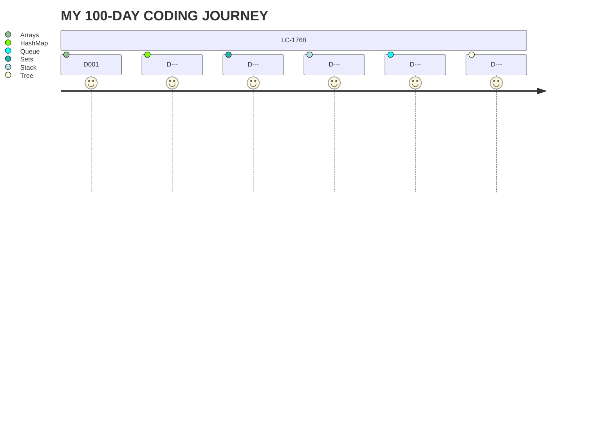

# 100 Days Of Code - Log


> [!IMPORTANT]
> All solutions from this log are my own.
> I am keeping track of my progress as I go through the challenge.
> I hope to see constant improvements on performance, algorithms, and data structures choices.

## Day 1

### Accomplishments
- Solved the Merge Strings Altenately on Leetcode #1768
- Learned how to traverse an array with multiple indices
- Struggled understanding all moving parts at first, I started actually thinking out loud at the end
  
<details>
  <summary>CLICK TO VIEW SOLUTION</summary>

   ```python
    def mergeAlternately(self, word1: str, word2: str) -> str:
        len1 = len(word1)
        len2 = len(word2)
        size = min(len1, len2) * 2
        result = ""
        counter = 0
        i = 0
        j = 0

        while size > 0:
            if counter % 2 == 0:
                result += word1[i]
                i += 1
            else:
                result += word2[j]
                j += 1
            size -= 1
            counter += 1

        if len1 > len2:
            result += word1[i:]
        elif len1 < len2:
            result += word2[j:]

        return result
   ```
  
</details>


<!---
### Day 0: February 30, 2016 (Example 1)
##### (delete me or comment me out)

**Today's Progress**: Fixed CSS, worked on canvas functionality for the app.

**Thoughts:** I really struggled with CSS, but, overall, I feel like I am slowly getting better at it. Canvas is still new for me, but I managed to figure out some basic functionality.

**Link to work:** [Calculator App](http://www.example.com)

### Day 0: February 30, 2016 (Example 2)
##### (delete me or comment me out)

**Today's Progress**: Fixed CSS, worked on canvas functionality for the app.

**Thoughts**: I really struggled with CSS, but, overall, I feel like I am slowly getting better at it. Canvas is still new for me, but I managed to figure out some basic functionality.

**Link(s) to work**: [Calculator App](http://www.example.com)


### Day 1: June 27, Monday

**Today's Progress**: I've gone through many exercises on FreeCodeCamp.

**Thoughts** I've recently started coding, and it's a great feeling when I finally solve an algorithm challenge after a lot of attempts and hours spent.

**Link(s) to work**
1. [Find the Longest Word in a String](https://www.freecodecamp.com/challenges/find-the-longest-word-in-a-string)
2. [Title Case a Sentence](https://www.freecodecamp.com/challenges/title-case-a-sentence)
--->
