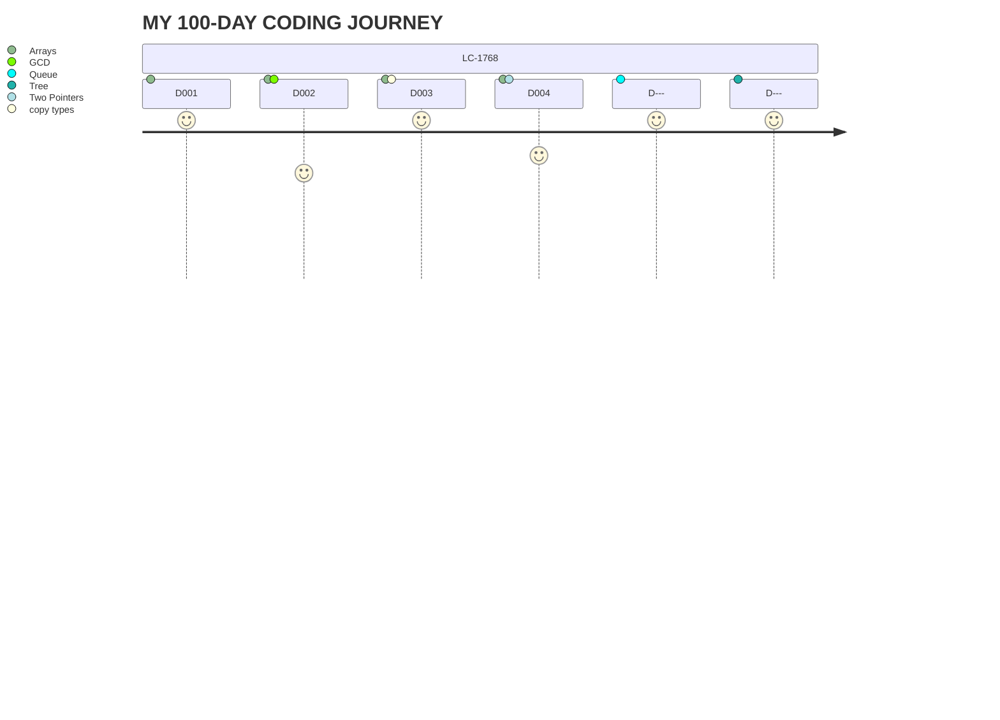

# 100 Days Of Code - Log


> [!IMPORTANT]
> All solutions from this log are my own
> I am keeping track of my progress as I go through the challenge
> I hope to see constant improvements on performance, algorithms, and data structures choices

## Day 1
Public accountability and date on [X](https://x.com/Edddushi/status/1799998093464838351)
> [!NOTE]
> Written in Python
### Accomplishments
- Solved the Merge Strings Altenately on Leetcode #1768
- Learned how to traverse an array with multiple indices
### Challenges
- Struggled understanding all moving parts at first, I started actually thinking out loud at the end

<details>
  <summary>CLICK TO VIEW SOLUTION</summary>

   ```python
    def mergeAlternately(self, word1: str, word2: str) -> str:
        len1 = len(word1)
        len2 = len(word2)
        size = min(len1, len2) * 2
        result = ""
        counter = 0
        i = 0
        j = 0

        while size > 0:
            if counter % 2 == 0:
                result += word1[i]
                i += 1
            else:
                result += word2[j]
                j += 1
            size -= 1
            counter += 1

        if len1 > len2:
            result += word1[i:]
        elif len1 < len2:
            result += word2[j:]

        return result
   ```
  
</details>


## Day 2
Public accountability and date on [X](https://x.com/Edddushi/status/1800370219149656207)
> [!NOTE]
> Written in Python
### Accomplishments
- Solved the Greatest Common Divisor of Strings on Leetcode #1071
- In hindisght I should have been able to tell by the name I would need my Maths hat for this one, but I learnt it the hard way
### Challenges
- This felt like an easy hard question. Not because the solution is particularly hard to implement, realizing the maths behind it is the tricky part
  
<details>
  <summary>CLICK TO VIEW SOLUTION</summary>

   ```python
    class Solution:
        def gcdOfStrings(self, str1: str, str2: str) -> str:
            size1 = len(str1)
            size2 = len(str2)
            longer_word = str1 if (size1 > size2) else str2
            shorter_word = str2 if (size1 > size2) else str1
            common_str = shorter_word
            i = 1
    
            if( size1 == 0 or size2 == 0):
                return ""
    
            for j in range(min(size1, size2)):
                gcd = len(common_str)

                #only if the substring is divisible then can it be a multiple of any of the strings
                if(size1 % gcd == 0 and size2 % gcd == 0):
    
                    multiplier1 = int(size1 / len(common_str))
                    multiplier2 = int(size2 / len(common_str))

                    #the substring must be a multiple of both strings not just the longest or shortest
                    if(str1 == common_str * multiplier1 and str2 == common_str * multiplier2):
                        return common_str

                #checking each substring starting from the full shortest word, one character less each time
                common_str = shorter_word[:-i]
                i += 1 
    
            return ""
   ```
  
</details>

## Day 3
Public accountability and date on [X](https://x.com/Edddushi/status/1800736235088146658)
> [!NOTE]
> Written in Python
### Accomplishments
- Solved the Kids With the Greatest Number of Candies Leetcode #1431
- I immediately knew what to do, I beat 72% of submission with my very first solution
### Challenges
- I couldn't figure out at first why my list was not making a shallow copy. It turns out that if you just assign the list like sorted_candies = candies, it makes a deep copy.
  
<details>
  <summary>CLICK TO VIEW SOLUTION</summary>

   ```python
    class Solution:
        def kidsWithCandies(self, candies: List[int], extraCandies: int) -> List[bool]:
            sorted_candies = candies[:]
            sorted_candies.sort()
            boolean_arr = []
    
            for i in range(len(candies)):
                if(candies[i] + extraCandies >= sorted_candies[-1]):
                    boolean_arr.append(True)
                else:
                    boolean_arr.append(False)
            return boolean_arr
   ```
</details>

## Day 4
Public accountability and date on [X](https://x.com/Edddushi/status/1800943305779257712)
> [!NOTE]
> Written in Python
### Accomplishments
| Reverse Vowels of a String Leetcode #345  | Can Place Flowers Leetcode #605 |
| ------------- | ------------- |
| Straightforward solution on this one (or maybe I am getting more intuitive)  | Learned that it is okay to start with the most intuitive approach rather than optimizing in my head  |
| Learned how to properly use two pointers by changing the values according to circumstance  | Used an incremental process to realize my mishaps|
### Challenges     
| Reverse Vowels of a String Leetcode #345  | Can Place Flowers Leetcode #605 |
| ------------- | ------------- |
| Dealing with two pointers that behave inversely was a learning hill | Completely underestimated the cases and ended up having a hard time adjusting from what I thought was absolutely right |
| Didn't go through my initial solution and was too confident |  It unfortunately took a long time before I realized that it was a matter of checking adjacent 0's|

<details>
  <summary>CLICK TO VIEW SOLUTION TO LC#345</summary>

   ```python
    def reverseVowels(self, s: str) -> str:
        vowels = ['a', 'e', 'i', 'o', 'u', 'U', 'O', 'I', 'E', 'A']
        sAsList = list(s)
        i = 0
        j = len(s)-1

        while(j > i):
            if s[i] in vowels:
                if s[j] in vowels:
                    temp = sAsList[j]
                    sAsList[j] = sAsList[i]
                    sAsList[i] = temp
                    j -= 1
                    i += 1
                else:
                    j -= 1
            else:
                i += 1
        
        return ''.join(sAsList)
   ```
</details>


<details>
  <summary>CLICK TO VIEW SOLUTION TO LC#605</summary>

   ```python
    def canPlaceFlowers(self, flowerbed: List[int], n: int) -> bool:
        alternate = 0
        i = 0

        if(n == 0):
            return True
        
        #Making sure we have a minimum of two spots in the flowerbed for the for loop logic
        if(len(flowerbed) == 1 and n <= 1 and flowerbed[0] == 0):
            return True
        elif(len(flowerbed) == 1 and n > 1):
            return False

        while(i < len(flowerbed)):
            if(i == 0 and flowerbed[i] == 0 and flowerbed[i+1] == 0):
                alternate += 1
                i += 1
            elif( i != 0 and i != len(flowerbed)-1 and flowerbed[i-1] == 0 and flowerbed[i] == 0 and flowerbed[i+1] == 0):
                alternate += 1
                i += 1
            elif(i == len(flowerbed)-1 and flowerbed[i] == 0 and flowerbed[i-1] == 0):
                alternate += 1
                i += 1
            i+=1


        return alternate >= n
   ```
</details>

<!---
### Day 0: February 30, 2016 (Example 1)
##### (delete me or comment me out)

**Today's Progress**: Fixed CSS, worked on canvas functionality for the app.

**Thoughts:** I really struggled with CSS, but, overall, I feel like I am slowly getting better at it. Canvas is still new for me, but I managed to figure out some basic functionality.

**Link to work:** [Calculator App](http://www.example.com)

### Day 0: February 30, 2016 (Example 2)
##### (delete me or comment me out)

**Today's Progress**: Fixed CSS, worked on canvas functionality for the app.

**Thoughts**: I really struggled with CSS, but, overall, I feel like I am slowly getting better at it. Canvas is still new for me, but I managed to figure out some basic functionality.

**Link(s) to work**: [Calculator App](http://www.example.com)


### Day 1: June 27, Monday

**Today's Progress**: I've gone through many exercises on FreeCodeCamp.

**Thoughts** I've recently started coding, and it's a great feeling when I finally solve an algorithm challenge after a lot of attempts and hours spent.

**Link(s) to work**
1. [Find the Longest Word in a String](https://www.freecodecamp.com/challenges/find-the-longest-word-in-a-string)
2. [Title Case a Sentence](https://www.freecodecamp.com/challenges/title-case-a-sentence)
--->
